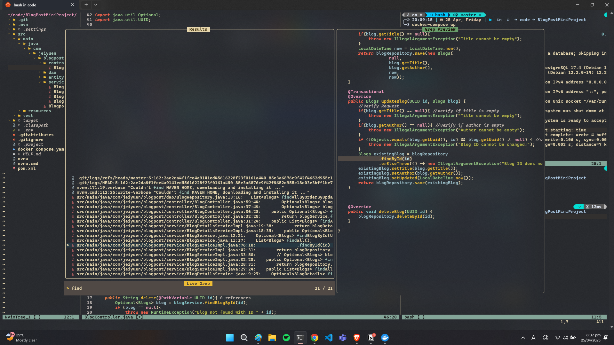
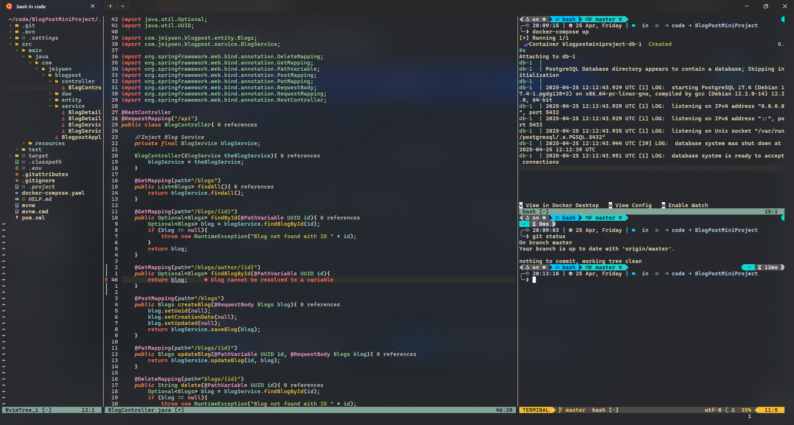

# Neovim Spring Boot + React Full-Stack Configuration

This repository contains my personal Neovim setup designed for **Full-Stack Development** using **Spring Boot** and **React**. It's optimized for Java, TypeScript, JavaScript, HTML, and CSS development in a **minimal yet powerful workflow**.

> ⚠This is a living config — I use it as both a backup and a way to track changes. Feel free to fork or adapt it to your own workflow!

---

## Special Thanks

Huge thanks to [**Unknown Koder**](https://github.com/unknownkoder/Java-FullStack-NeoVim-Configuration) for his excellent [YouTube guide](https://www.youtube.com/watch?v=zbpF3te0M3g&t=11362s), which served as the foundation for this setup.

---

## Features & Focus

This configuration is built for:

- **Java + Spring Boot** development
- **React** with TypeScript/JavaScript
- Fuzzy file finding, Git integration, debugging, and code formatting
- Minimal UI with powerful developer ergonomics

---

## Preview

  


---

## Plugins

### Plugin Manager
- [`lazy.nvim`](https://github.com/folke/lazy.nvim)

### UI & Theme
- [`poimandres.nvim`](https://github.com/olivercederborg/poimandres.nvim) — Current theme
- [`nvim-web-devicons`](https://github.com/nvim-tree/nvim-web-devicons)
- [`nvim-tree.lua`](https://github.com/nvim-tree/nvim-tree.lua) — File explorer
- [`which-key.nvim`](https://github.com/folke/which-key.nvim) — Keybinding hints
- [`nvim-highlight-colors`](https://github.com/brenoprata10/nvim-highlight-colors)

### Fuzzy Finder / Navigation
- [`telescope.nvim`](https://github.com/nvim-telescope/telescope.nvim)
- [`telescope-ui-select.nvim`](https://github.com/nvim-telescope/telescope-ui-select.nvim)
- [`harpoon`](https://github.com/ThePrimeagen/harpoon)

### Syntax Highlighting & Treesitter
- [`nvim-treesitter`](https://github.com/nvim-treesitter/nvim-treesitter)
- [`nvim-ts-autotag`](https://github.com/windwp/nvim-ts-autotag)
- [`nvim-ts-context-commentstring`](https://github.com/JoosepAlviste/nvim-ts-context-commentstring)

### LSP, Formatters & Linters
- [`mason.nvim`](https://github.com/williamboman/mason.nvim)
- [`mason-lspconfig.nvim`](https://github.com/williamboman/mason-lspconfig.nvim)
- [`nvim-lspconfig`](https://github.com/neovim/nvim-lspconfig)
- [`none-ls.nvim`](https://github.com/nvimtools/none-ls.nvim)
- [`none-ls-extras.nvim`](https://github.com/nvimtools/none-ls-extras.nvim)
- [`typescript-tools.nvim`](https://github.com/pmizio/typescript-tools.nvim)
- [`nvim-jdtls`](https://github.com/mfussenegger/nvim-jdtls)
- [`springboot-nvim`](https://github.com/elmcgill/springboot-nvim)
- [`lsp_signature.nvim`](https://github.com/ray-x/lsp_signature.nvim)

### Completion
- [`nvim-cmp`](https://github.com/hrsh7th/nvim-cmp)
- [`cmp-nvim-lsp`](https://github.com/hrsh7th/cmp-nvim-lsp)
- [`cmp-buffer`](https://github.com/hrsh7th/cmp-buffer)
- [`cmp-path`](https://github.com/hrsh7th/cmp-path)
- [`LuaSnip`](https://github.com/L3MON4D3/LuaSnip)
- [`cmp_luasnip`](https://github.com/saadparwaiz1/cmp_luasnip)
- [`friendly-snippets`](https://github.com/rafamadriz/friendly-snippets)

### Debugging
- [`nvim-dap`](https://github.com/mfussenegger/nvim-dap)
- [`nvim-dap-ui`](https://github.com/rcarriga/nvim-dap-ui)
- [`mason-nvim-dap.nvim`](https://github.com/jay-babu/mason-nvim-dap.nvim)

### Utilities
- [`nvim-autopairs`](https://github.com/windwp/nvim-autopairs)
- [`Comment.nvim`](https://github.com/numToStr/Comment.nvim)
- [`gitsigns.nvim`](https://github.com/lewis6991/gitsigns.nvim)
- [`vim-fugitive`](https://github.com/tpope/vim-fugitive)
- [`plenary.nvim`](https://github.com/nvim-lua/plenary.nvim)
- [`nvim-nio`](https://github.com/nvim-neorocks/nvim-nio)

---

## LSPs & Tools Installed via Mason

### LSP Servers
- `jdtls` — Java
- `typescript-language-server`
- `tailwindcss-language-server`
- `html-lsp`
- `css-lsp`
- `eslint-lsp`
- `emmet-ls`
- `lua-language-server`
- `harper-ls`

### Formatters & Linters
- `google-java-format`
- `prettier`
- `stylua`
- `ts-standard`
- `eslint_d`

### Debugging
- `java-debug-adapter`
- `java-test`

---

## Requirements

This config is intended to work with most Unix-like environments.

Make sure the following tools are installed:

- Neovim `v0.9+`
- Java 17+
- Node.js (LTS)
- npm
- Git
- Ripgrep
- `fd` (optional but recommended for Telescope)

---

## 🚀 Installation

```bash
git clone https://github.com/gjuanillo/my-nvim-config.git ~/.config/nvim
nvim
```

## 🧰 Others

This Neovim setup is part of a broader terminal-based development workflow that includes:

- 🧩 **[My Dotfiles](https://github.com/gjuanillo/dotfiles)** — Shell, Git, Terminal, and general unix system configurations for my mint and arch machines.
- 🪟 **[Tmux](https://github.com/tmux/tmux)** — Terminal multiplexer for efficient session management.
- 📁 **[Yazi](https://github.com/sxyazi/yazi)** — Blazing-fast terminal file manager with modern UI and keybindings.

These tools complement the Neovim experience and help create a cohesive, keyboard-driven environment.
